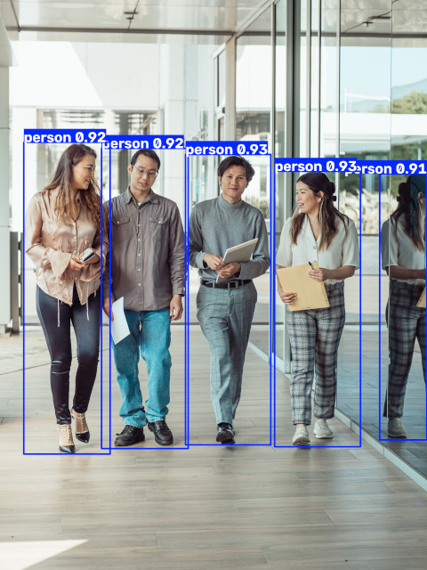
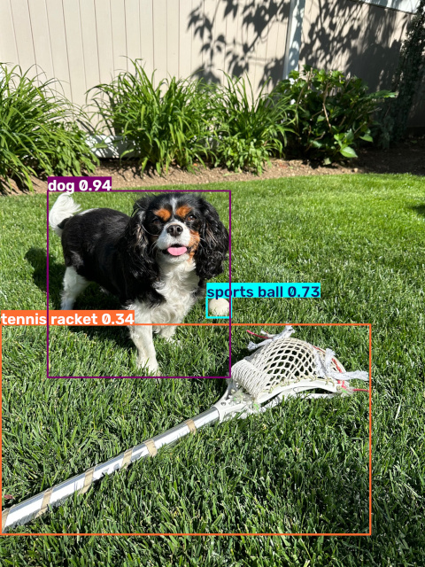
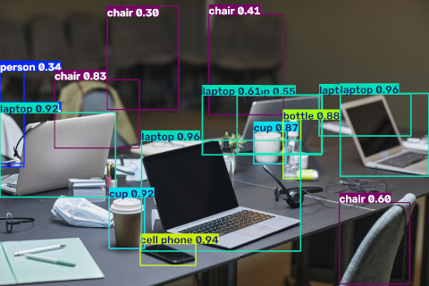

# Image YOLO Detector

Small Python utility for running offline YOLO object detection on local image files and storing the detected objects as JSON sidecar files.

The script scans either a folder or a single image file, runs object detection using an Ultralytics YOLO model, and writes a `.yolo.json` file next to each processed image.

## Current features

- Process all `.jpg` and `.png` images in a folder
- Process a single image file
- Select YOLO model from command line
- Configure detection confidence threshold
- Skip images that already have `.yolo.json` output
- Optional overwrite mode
- Optional saving of YOLO annotated images with detection boxes

## Requirements

Hardware:
- GPU

Software:
- Python 3
- Ultralytics YOLO

Recommended setup:

```bash
python3 -m venv venv
source venv/bin/activate
pip install -U pip
pip install ultralytics
```

## Examples:

This was processed on NVidia RTX 5070Ti within a second or two by yolo11s.pt (first picture) and yolo11m.pt models.



Example image: original photo by [Kindel Media on Pexels](examples/image0.jpg).
Annotated output generated by this project.



Example image: original photo by [Brendan Murphy on Pexels](examples/image0.jpg).
Annotated output generated by this project.



Example image: original photo by [Jep Gambardella on Pexels](examples/image0.jpg).
Annotated output generated by this project.

## Usage

Process all supported images in the current folder:

```bash
python yolo_detect.py
```

Process all supported images in a specific folder:

```bash
python yolo_detect.py --folder ./photos
```

Process one image file:

```bash
python yolo_detect.py --file ./photo.jpg
```

Use a specific YOLO model:

```bash
python yolo_detect.py --folder ./photos --model yolo11s.pt
```

Use a different confidence threshold:

```bash
python yolo_detect.py --folder ./photos --conf 0.40
```

Overwrite existing `.yolo.json` files:

```bash
python yolo_detect.py --folder ./photos --overwrite
```

Save annotated images with detection boxes:

```bash
python yolo_detect.py --folder ./photos --save-detection
```

Combine options:

```bash
python yolo_detect.py --folder ./photos --model yolo11m.pt --conf 0.35 --overwrite --save-detection
```

## Command line arguments

| Argument | Default value | Description |
|---|---:|---|
| `--folder` | `./` | Folder containing images to process. This is used when `--file` is not provided. |
| `--file` | `None` | Single image file to process. When set, `--folder` is ignored. |
| `--model` | `yolo11s.pt` | YOLO model to use. |
| `--conf` | `0.25` | Detection confidence threshold. Detections below this value are ignored by YOLO. |
| `--save-detection` | `False` | Save annotated image output generated by YOLO with bounding boxes drawn on the image. |
| `--overwrite` | `False` | Recreate `.yolo.json` files even when they already exist. |

## Output

For each processed image, the script creates a JSON sidecar file with the same base filename and the `.yolo.json` extension.

Example input:

```text
photo.jpg
```

Generated output:

```text
photo.yolo.json
```

Example `.yolo.json` output:

```json
{
  "image": "photo.jpg",
  "model": "yolo11s.pt",
  "detections": [
    {
      "label": "person",
      "confidence": 0.9321,
      "bbox_xyxy": [
        120.5,
        80.0,
        420.3,
        760.8
      ]
    },
    {
      "label": "bicycle",
      "confidence": 0.8874,
      "bbox_xyxy": [
        300.1,
        420.2,
        900.7,
        780.4
      ]
    }
  ]
}
```

When `--save-detection` is used, Ultralytics YOLO also saves annotated images into a `runs/detect/...` folder.

## Detection fields

Each item in the `detections` array represents one detected object.

| Field | Description |
|---|---|
| `label` | Object class detected by YOLO, for example `person`, `car`, `dog`, `bicycle`. |
| `confidence` | Detection confidence returned by YOLO. Higher values mean YOLO is more confident about the detection. |
| `bbox_xyxy` | Bounding box coordinates in `[x1, y1, x2, y2]` format. Coordinates are pixel positions in the original image. |

### Bounding box format

The `bbox_xyxy` field uses this format:

```text
[x1, y1, x2, y2]
```

Where:

| Value | Meaning |
|---|---|
| `x1` | Left side of the bounding box |
| `y1` | Top side of the bounding box |
| `x2` | Right side of the bounding box |
| `y2` | Bottom side of the bounding box |

## Notes

YOLO model files such as `yolo11n.pt`, `yolo11s.pt`, and `yolo11m.pt` are downloaded model weights. They are not source files and should usually not be committed to Git.

## Current project scope

The current version only performs YOLO object detection:

```text
image -> YOLO -> .yolo.json sidecar
```

The `.yolo.json` sidecar file can later be used by other tools to create searchable photo metadata.


Possible future features:

- LLaVA/Ollama full-image description
- Cropping YOLO detections for detailed object analysis
- Merging YOLO and LLaVA tags
- Face clustering with InsightFace
- Recursive folder scanning
- Support for additional image extensions
- Final combined `.tags.json` sidecar output

## License

Private experimental project unless a license is added later.